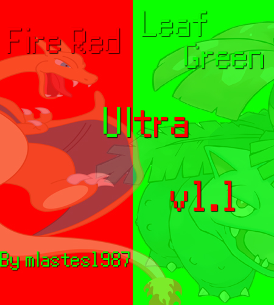

# Pokémon FireRed and LeafGreen Ultra

Based on the pokefirered disassembly with Pokeemerald Expansion Updates from [**cawtds**](https://github.com/cawtds/pokefirered-expansion)

# Features

- **Reusable TMs**

- **Forgettable HMs** Without a Move Tutor.

- **Startup Money** Startup money has been changed from 3,000 to 35,000 Pokedollars.

- **HGSS Pokedex Plus** Backported from HeartGold SoulSilver, you get to enjoy the features of Pokedex Plus.

- **Follower Pokemon** Any Pokemon in the first party slot will follow you through the overworld.

- **Trade Evolutions** All Trade Evolutions can evolve by using either a Linking Cable or their specific evolution items like Metal Coat or King's Rock, but can also evolve by trading between FR and LG out of the box.

- **Debug Menu** By pressing R+Start you can open a special debug menu made by a few people. [**See here**](/include/config/debug.h) and it includes features like giving you items, pokemon, and other changes to the game.

- **Double Battles** All double battles no longer require you to have two pokemon in your party and 25% of the time wild battles will be double.  This also means that you can battle two trainers at once.

- **Gen 5 Map Area Popups** All Map Area Popups are switched to Gen 5 and include a 12hr clock displayed at the bottom.

- **Gen 6 Exp. Share** Exp Share is available in your PC at the start of the game, and much like Gen 6 gives experience points to your whole party during battle and capture.

- **Running Indoors** This makes traversing all of Kanto much easier and faster, great for speed runs.

- **Fast-Run** During wild battles you can hold B to run.

- **Known Issues** Any known or reported issues will be put here.

# Thanks/Credit

Thank you to [**cawtds**](https://github.com/cawtds) for bringing the Emerald Expansion to Fire Red.

Thank you to [**rh-hideout**](https://github.com/rh-hideout/pokeemerald-expansion) for the Emerald Expansion code base.
